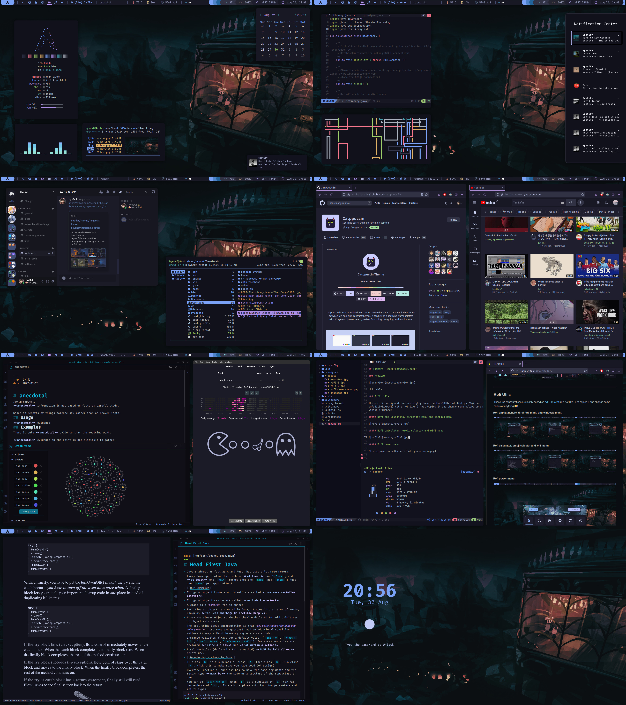
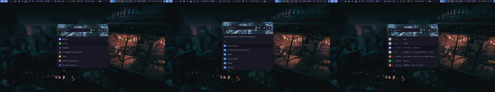
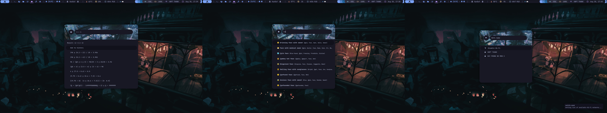

<h2 align="center"> ━━━━━━  ❖  ━━━━━━ </h2>

<!-- BADGES -->

<h2></h2>

# HynDuf's dotfiles

## :pencil: <samp>Table of contents</samp>

- [:herb: <samp>About</samp>](#about)
- [:camera: <samp>Showcase</samp>](#showcase)
    - [<samp>Overview</samp>](#overview) 
    - [<samp>Rofi Utils</samp>](#rofi-utils)
- [:tada: <samp>Credits</samp>](#credits)

<a name="about"/>

## :herb: <samp>About</samp>

Thanks for dropping by! 

This is my personal repository for my Arch dotfiles (always WIP)

Here are some information about my setup: 

- Window Manager: [`bspwm`](https://github.com/baskerville/bspwm)
- Compositor: [`pijulius/picom`](https://github.com/pijulius/picom)
- Terminal: [`st`](https://github.com/siduck/st)
- Shell: [`zsh`](https://www.zsh.org/)
- Editor: [`neovim`](https://github.com/neovim/neovim) ([`nvchad`](https://nvchad.github.io/))
- Panel: [`polybar`](https://github.com/polybar/polybar)
- Notification Manager: [`dunst`](https://github.com/dunst-project/dunst)
- Application Launcher: [`rofi`](https://github.com/davatorium/rofi)
- File Manager: [`ranger`](https://github.com/ranger/ranger)                                                   

<a name="showcase"/>

## :camera: <samp>Showcase</samp>

<a name="overview"/>

### <samp>Overview</samp>

Here are some details:

- **Color schemes**: a combination of [`catppuccin`](https://github.com/catppuccin) and [`tokyonight`](https://github.com/zatchheems/tokyo-night-alacritty-theme/blob/main/tokyo-night.yaml)
- **Theme**: [`catppuccin gtk`](https://github.com/catppuccin/gtk) and [`catppuccin cursor`](https://github.com/catppuccin/cursors)
- **System fetch**: a bash script taken somewhere on **r/unixporn** ([`bin/sysfetch`](https://github.com/HynDuf7/dotfiles/blob/main/bin/sysfetch))
- **Audio visualizer**: [`cava`](https://github.com/karlstav/cava)
- **Eww calendar**: [`calendar`](https://github.com/HynDuf7/dotfiles/tree/main/.config/eww)
- **File manager**: [`ranger`](https://github.com/ranger/ranger) with [`ranger devicons`](https://github.com/alexanderjeurissen/ranger_devicons) and [`ueberzug`](https://github.com/seebye/ueberzug) image previewer
- **Pipes script**: [`pipes.sh`](https://github.com/pipeseroni/pipes.sh)
- **Notification center**: [`script`](https://github.com/HynDuf7/dotfiles/blob/main/bin/noticenter) combine [`rofi configuration`](https://github.com/HynDuf7/dotfiles/blob/main/.config/rofi/themes/noticenter.rasi) with [`dunst notification logger`](https://github.com/HynDuf7/dotfiles/blob/main/bin/dunst-logger) (~~copied~~ inspired by [Barbaross/Nebula dotfiles](https://gitlab.com/Barbaross/Nebula))
- **Discord theme**: [`tokyonight custom css`](https://github.com/HynDuf7/dotfiles/tree/main/.config/BetterDiscord/data/stable/custom.css) (taken from somewhere)
- **Firefox**: [`catppuccin theme`](https://addons.mozilla.org/en-US/firefox/addon/catppuccin-mocha-mauve/) with [`Github`](https://github.com/catppuccin/github) and [`Youtube`](https://github.com/catppuccin/youtube) Stylus
- **Note-taking**: [`obsidian`](https://obsidian.md/) with Obsidianite theme
- **Flashcards study**: [`anki`](https://apps.ankiweb.net/) with some additional plugins
- **Text editor**: [`neovim`](https://github.com/neovim/neovim) with [`nvchad`](https://nvchad.github.io/) ([`custom folder`](https://github.com/HynDuf7/dotfiles/tree/main/.config/nvim/lua/custom))
- **PDF reader**: [`zathura`](https://github.com/pwmt/zathura) with [`catppuccin theme`](https://github.com/catppuccin/zathura) (and some color configs)
- **Screen lock**: [`script`](https://github.com/HynDuf7/dotfiles/blob/main/bin/screen-lock) using [`i3lock-color`](https://github.com/Raymo111/i3lock-color)

<h2></h2>

<a name="rofi-utils"/>

### <samp>Rofi Utils</samp>

These rofi configurations are highly based on [adi1090x/rofi](https://github.com/adi1090x/rofi) (it's not like I just copied it and change some colors or anything :flushed:)

##### Rofi app launchers, directory menu and windows menu

##### Rofi calculator, emoji selector and wifi menu

##### Rofi power menu

<a name="credits"/>

## :tada: <samp>Credits</samp>

- `README.md` inspired by [janleigh/dotfiles](https://github.com/janleigh/dotfiles) and [beyond9thousand/dotfiles](https://github.com/beyond9thousand/dotfiles)
- [siduck](https://github.com/siduck) for the incredible [nvchad](https://github.com/NvChad/NvChad) and for helping out all the time
- [r/unixporn](https://www.reddit.com/r/unixporn/) for endless inspiration

   

