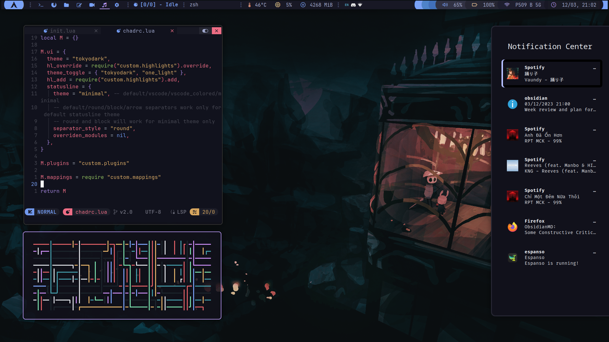
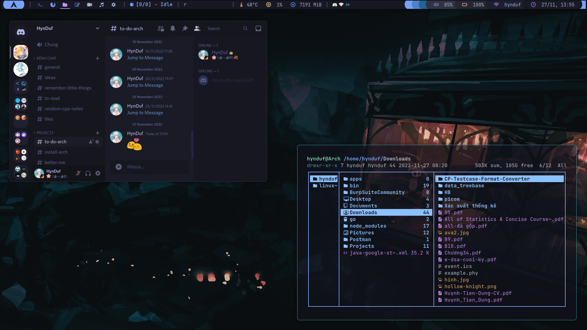
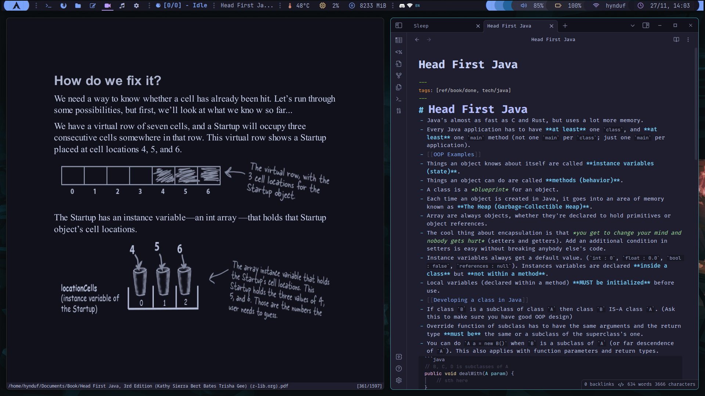

<h2 align="center"> ━━━━━━  ❖  ━━━━━━ </h2>

<!-- BADGES -->
<div align="center">

[](https://github.com/HynDuf7/dotfiles/stargazers)
[](https://github.com/HynDuf7/dotfiles)
[](https://visitorbadge.io/status?path=https%3A%2F%2Fgithub.com%2FHynDuf7%2Fdotfiles)
[](https://github.com/HynDuf7/dotfiles/blob/main/LICENSE.md)

</div>

<h2></h2>

# HynDuf's dotfiles

## :pencil: <samp>Table of contents</samp>

- [:herb: <samp>About</samp>](#about)
- [:camera: <samp>Showcase</samp>](#showcase)
    - [<samp>Overview</samp>](#overview) 
    - [<samp>Rofi Utils</samp>](#rofi-utils)
    - [<samp>Fonts</samp>](#fonts)
- [:wrench: <samp>Set up</samp>](#setup)
    - [<samp>Preinstall</samp>](#preinstall)
    - [<samp>Dependency</samp>](#dependency)
    - [<samp>Polybar</samp>](#polybar)
    - [<samp>Dunst</samp>](#dunst)
    - [<samp>Rofi and Eww</samp>](#rofi-and-eww)
    - [<samp>Picom</samp>](#picom)
    - [<samp>Sxhkd Keybindings</samp>](#sxhkd-keybindings)
    - [<samp>Others</samp>](#others)
- [:tada: <samp>Credits</samp>](#credits)

<a name="about"/>

## :herb: <samp>About</samp>

<div style="flex:1;padding: 11px 0px 0px 10px">

</div>

Thanks for dropping by! 

This is my personal repository for my Arch dotfiles (always WIP)

Here are some information about my setup: 


- Window Manager: [`bspwm`](https://github.com/baskerville/bspwm)
- Compositor: [`pijulius/picom`](https://github.com/pijulius/picom)
- Terminal: [`st`](https://github.com/siduck/st)
- Shell: [`zsh`](https://www.zsh.org/)
- Editor: [`neovim`](https://github.com/neovim/neovim) ([`nvchad`](https://nvchad.github.io/))
- Panel: [`polybar`](https://github.com/polybar/polybar)
- Notification Manager: [`dunst`](https://github.com/dunst-project/dunst)
- Application Launcher: [`rofi`](https://github.com/davatorium/rofi)
- File Manager: [`ranger`](https://github.com/ranger/ranger)

<a name="showcase"/>

## :camera: <samp>Showcase</samp>

<a name="overview"/>

### <samp>Overview</samp>

Here are some details about programs in the screenshots:

- **Color schemes**: a combination of [`catppuccin`](https://github.com/catppuccin) and [`tokyonight`](https://github.com/zatchheems/tokyo-night-alacritty-theme/blob/main/tokyo-night.yaml)
- **Theme**: [`catppuccin gtk`](https://github.com/catppuccin/gtk) and [`catppuccin cursor`](https://github.com/catppuccin/cursors)
- **System fetch**: a bash script taken somewhere on **r/unixporn** ([`bin/sysfetch`](https://github.com/HynDuf7/dotfiles/blob/main/bin/sysfetch))
- **Audio visualizer**: [`cava`](https://github.com/karlstav/cava)
- **Eww calendar**: [`calendar`](https://github.com/HynDuf7/dotfiles/tree/main/.config/eww)
- **File manager**: [`ranger`](https://github.com/ranger/ranger) with [`ranger devicons`](https://github.com/alexanderjeurissen/ranger_devicons) and [`ueberzug`](https://github.com/seebye/ueberzug) image previewer
- **Pipes script**: [`pipes.sh`](https://github.com/pipeseroni/pipes.sh)
- **Notification center**: [`script`](https://github.com/HynDuf7/dotfiles/blob/main/bin/noticenter) combine [`rofi configuration`](https://github.com/HynDuf7/dotfiles/blob/main/.config/rofi/themes/noticenter.rasi) with [`dunst notification logger`](https://github.com/HynDuf7/dotfiles/blob/main/bin/dunst-logger) (~~copied~~ inspired by [Barbaross/Nebula dotfiles](https://gitlab.com/Barbaross/Nebula))
- **Discord theme**: [`tokyonight custom css`](https://github.com/HynDuf7/dotfiles/tree/main/.config/BetterDiscord/data/stable/custom.css) (taken from somewhere)
- **Firefox**: [`catppuccin theme`](https://addons.mozilla.org/en-US/firefox/addon/catppuccin-mocha-mauve/) with [`Github`](https://github.com/catppuccin/github) and [`Youtube`](https://github.com/catppuccin/youtube) Stylus
- **Note-taking**: [`obsidian`](https://obsidian.md/) with Obsidianite theme
- **Flashcards study**: [`anki`](https://apps.ankiweb.net/) with some additional plugins
- **Text editor**: [`neovim`](https://github.com/neovim/neovim) with [`nvchad`](https://nvchad.github.io/) ([`custom folder`](https://github.com/HynDuf7/dotfiles/tree/main/.config/nvim/lua/custom))
- **PDF reader**: [`zathura`](https://github.com/pwmt/zathura) with [`catppuccin theme`](https://github.com/catppuccin/zathura) (and some color configs)
- **Spotify theme**: [`spicetify`](https://spicetify.app/docs/getting-started) with [`catppuccin theme`](https://github.com/catppuccin/spicetify)
- **Screen lock**: [`script`](https://github.com/HynDuf7/dotfiles/blob/main/bin/screen-lock) using [`i3lock-color`](https://github.com/Raymo111/i3lock-color)









<h2></h2>

<a name="rofi-utils"/>

### <samp>Rofi Utils</samp>

These rofi configurations are highly based on [adi1090x/rofi](https://github.com/adi1090x/rofi) (it's not like I just copied it and changed some colors or anything :flushed:)

<h2></h2>

##### Rofi app launchers, directory menu and windows menu


<h2></h2>

##### Rofi calculator, emoji selector and wifi menu


<h2></h2>

##### Rofi power menu


<h2></h2>

<a name="fonts"/>

### <samp>Fonts</samp>

- [`JetBrainsMono Nerd Font`](https://github.com/jtbx/jetbrainsmono-nerdfont)
- [`Iosevka Nerd Font`](https://github.com/ryanoasis/nerd-fonts/tree/master/patched-fonts/Iosevka)
- [`FiraCode`](https://github.com/tonsky/FiraCode) (for `lxappearance` font theme)
- [`Material Icon and Feathers`](https://github.com/Murzchnvok/polybar-collection#prerequisites) (for polybar)

<a name="setup"/>

## :wrench: <samp>Set up</samp>

:warning: **Note**: This configuration was made for my Laptop (Arch-based distribution specifically), so some things might not work on yours, in that case, please try if you can fix that up as much as possible, or you can open an issue for help :smile:.

This was made for a `1920x1080` and `75` dpi screen.

Most programs can be installed and used easily by following guides from their own github (I already added as many links as possible). Some other harder ones I'll state below.

<a name="preinstall"/>


### <samp>Preinstall</samp>

Just to be tidy, create a folder for your about-to-download packages as you would want to delete redundant things afterward.

```sh
mkdir ~/Downloads
cd ~/Downloads
```

Clone my dotfiles in advance for later uses (`~/Downloads/dotfiles`):

```sh
git clone https://github.com/HynDuf7/dotfiles
```

Let's set up the necessary scripts. Copy them to yours and grant execute permission (You don't need all the scripts. You can keep only the ones you need):


```sh
cp -r ~/Downloads/dotfiles/bin ~/bin
chmod +x ~/bin/*
```

Add that `~/bin` folder to your `$PATH` as well, in your `.bashrc` or `.zshrc` add the following:

```sh
export PATH="$HOME/bin:$PATH"
```

<a name="dependency"/>


### <samp>Dependency</samp>


First of all, we need `yay` and `git` (if you haven't had them):

```sh
sudo pacman -S --needed git base-devel
git clone https://aur.archlinux.org/yay.git
cd yay
makepkg -si
```

Then let's install all the needed packages:

```sh
yay -S bspwm brightnessctl dunst eww-git feh i3lock-color nerd-fonts-jetbrains-mono polybar pomo papirus-icon-theme ranger rofi rofi-calc rofi-emoji sxhkd ttf-fira-code ttf-iosevka-nerd ueberzug
```

<a name="polybar"/>

### <samp>Polybar</samp>


Firstly, let's install `Material Icon and Feathers` for our `polybar` icons.

```sh
mkdir ~/.fonts
cd ~/Downloads
git clone https://github.com/Murzchnvok/polybar-collection
cp -r ./polybar-collection/fonts/* ~/.fonts/
fc-cache -fv
```

Copy my `polybar` setup into yours:

```sh
cp -r ~/Downloads/dotfiles/.config/polybar ~/.config/polybar
```

Enable autostart `polybar` when starting `bspwm`:

```sh
chmod +x ~/.config/polybar/launch.sh
```

Then add this to your `~/.config/bspwm/bspwmrc` (see [`mine`](https://github.com/HynDuf7/dotfiles/blob/main/.config/bspwm/bspwmrc))

```sh
$HOME/.config/polybar/launch.sh &
```

:warning: Note: My `~/.config/bspwm/bspwmrc` file is not for straight copying. There are many things that are personal and unrelated (can cause confusion if you don't understand what they are for). Use it responsibly.

:exclamation: Note: The below section in the `polybar` is from [`pomo`](https://github.com/kevinschoon/pomo) package which is a pomodoro timer. When running, it would update in the `polybar`.


<a name="dunst"/>

### <samp>Dunst</samp>

Copy my `dunst` configuration into yours:

```sh
cp -r ~/Downloads/dotfiles/.config/dunst ~/.config/dunst
```

Add `dunst` startup to your `~/.config/bspwm/bspwmrc` (see [`mine`](https://github.com/HynDuf7/dotfiles/blob/main/.config/bspwm/bspwmrc)):

```sh
dunst -conf $HOME/.config/dunst/dunstrc &
```

<a name="rofi-and-eww"/>

### <samp>Rofi and Eww</samp>

Copy my `rofi` and `eww` configuration into yours:

```sh
cp -r ~/Downloads/dotfiles/.config/rofi ~/.config/rofi
cp -r ~/Downloads/dotfiles/.config/eww ~/.config/eww
```

In my `~/.config/sxhkd/sxhkdrc` file, you can see some related keybindings:

```
super + c
    rofi -show drun -theme "$HOME/.config/rofi/themes/app-launcher.rasi"

super + alt + z
	~/bin/powermenu

super + shift + c
    rofi -show calc -modi calc -theme "$HOME/.config/rofi/themes/calc.rasi"

super + shift + x
    ~/bin/noticenter

super + shift + z
    ~/bin/wifimenu

super + shift + f
    ~/bin/calendar-launcher

super + shift + e
    rofi -modi emoji -show emoji -theme "$HOME/.config/rofi/themes/emojimenu.rasi"
```

From those, you can imply that the command to run the rofi utils are (Bind it to your keymappings or use my [`sxhkdrc`](https://github.com/HynDuf7/dotfiles/blob/main/.config/sxhkd/sxhkdrc)):

- App launcher/Directory menu/Windows menu:
    ```sh
    rofi -show drun -theme "$HOME/.config/rofi/themes/app-launcher.rasi"
    ```
    There are some [`rofi keybindings`](https://github.com/HynDuf7/dotfiles/blob/main/.config/rofi/config.rasi) that you can learn to use to navigate.
- Calculator (remember the package `rofi-calc` we have already downloaded at [<samp>Dependency</samp>](#dependency)):
    ```sh
    rofi -show calc -modi calc -theme "$HOME/.config/rofi/themes/calc.rasi"
    ```
- Emoji selector (package `rofi-emoji`):
    ```sh
    rofi -modi emoji -show emoji -theme "$HOME/.config/rofi/themes/emojimenu.rasi"
    ```
- Power menu:
    ```sh
    ~/bin/powermenu
    ```

- Notification center:
    ```sh
    ~/bin/noticenter
    ```
- Wifi menu:
    ```sh
    ~/bin/wifimenu
    ```
- Calendar (This is `eww` widgets and not rofi):
    ```sh
    ~/bin/calendar-launcher
    ```


<a name="picom"/>

### <samp>Picom</samp>

This is a `picom` fork with splendid animations so we have to build it on our own.

First install all the dependencies required to build the compositor:

```sh
yay -S libconfig libev libxdg-basedir pcre pixman xcb-util-image xcb-util-renderutil hicolor-icon-theme libglvnd libx11 libxcb libxext libdbus asciidoc uthash
```

Then let's build it:

```sh
cd ~/Downloads
git clone https://github.com/pijulius/picom.git
cd picom/
meson --buildtype=release . build --prefix=/usr -Dwith_docs=true
sudo ninja -C build install
```

Copy my `picom` configuration into yours:

```sh
cp -r ~/Downloads/dotfiles/.config/picom ~/.config/picom
```

Then enable `picom` start-up when starting `bspwm` by adding this to your `~/.config/bspwm/bspwmrc` (see [`mine`](https://github.com/HynDuf7/dotfiles/blob/main/.config/bspwm/bspwmrc))

```sh
picom &
```


<a name="sxhkd-keybindings"/>

### <samp>Sxhkd Keybindings</samp>

This is some of main keybindings in my [`sxhkdrc keybindings`](https://github.com/HynDuf7/dotfiles/blob/main/.config/sxhkd/sxhkdrc) if you happen to use it:

|Action|Keybinding|
|---|---|
|App launcher|<code>super + c</code>|
|Hide / Unhide Bar|<code>super + x</code>|
|Terminal|<code>super + Return</code>|
|Restart bspwm|<code>super + alt + r</code>|
|Reload sxhkd|<code>super + Esc</code>|
|Close program|<code>super + w</code>|
|Quit bspwm|<code>super + alt + q</code>|
|Increase/Decrease brightness|<code>super + F10/F11</code>|
|Increase/Decrease volume|<code>super + shift + F10/F11</code>|

<a name="others"/>

### <samp>Others</samp>

For other ones please follow the link to the application you want to install and do it on your own. I believe you can do it in no time. Good luck :wink:

:exclamation: In case you are desperately stuck, open an issue. I would consider updating additional guides for the ones you need.


<a name="credits"/>

## :tada: <samp>Credits</samp>

- `README.md` inspired by [janleigh/dotfiles](https://github.com/janleigh/dotfiles) and [beyond9thousand/dotfiles](https://github.com/beyond9thousand/dotfiles)
- [siduck](https://github.com/siduck) for the incredible [nvchad](https://github.com/NvChad/NvChad) and for helping out all the time
- [r/unixporn](https://www.reddit.com/r/unixporn/) for endless inspiration

<p align="center">
   
</p>
